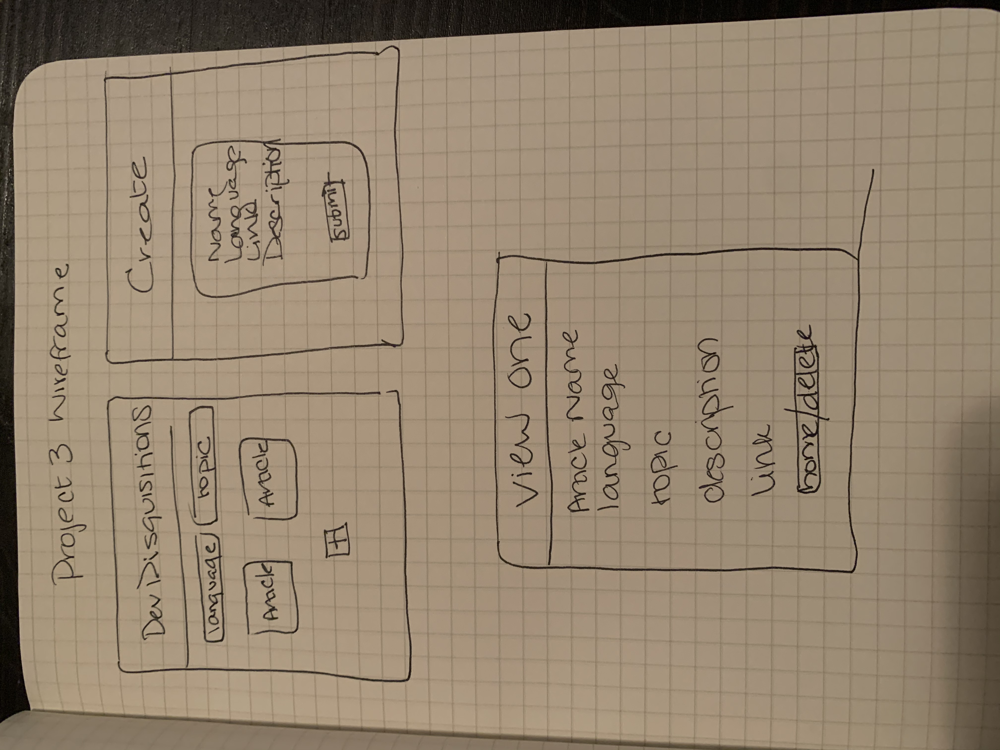
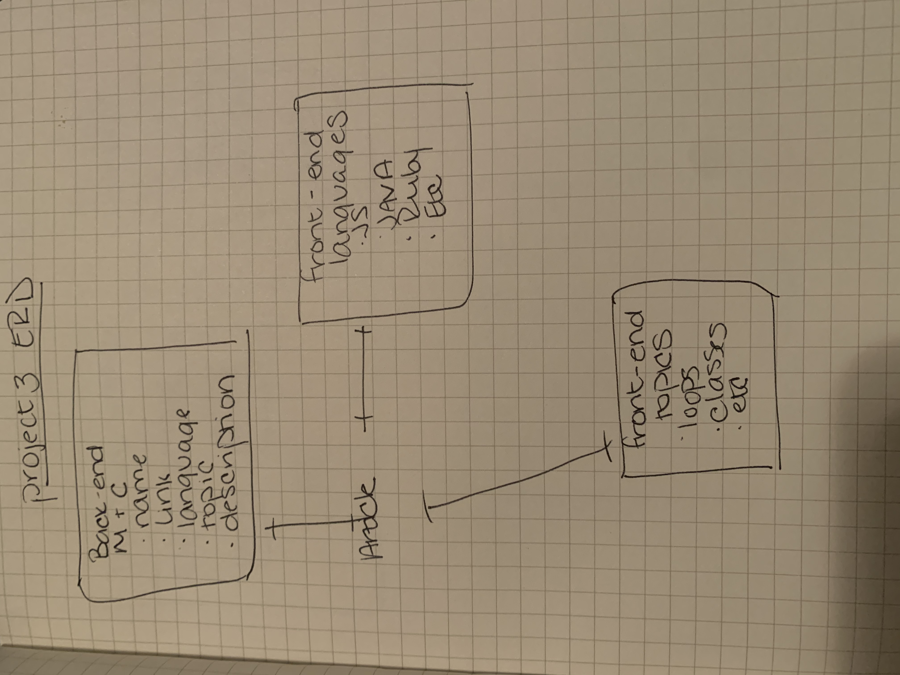

# Dev Disquisitions
### Readme

#### Overview
Dev Disquisitons is intended to be used by individuals who are learning to code, or those who want to share their educational resources. Often in the process of trying to understand difficult concepts, I have found comments in Reddit posts or obscure articles to be the most helpful. I wanted to develop a place where that information can be stored and shared with others. This website is intended to be educational and instructive, while reducing the amount of time that users would otherwise spend googling articles on a specific topic. 

#### Project Links
* [Deployed Application](https://dev-disquisitions.herokuapp.com/)
* [Trello Board](https://trello.com/b/AYzosc05/devdisquisitions)

#### Technical Specifications
* Built with React, Axios, MongoDB, and Mongoose
* Uses JS, HTML, and CSS
* Had one model with specific schema's to intake the user data
* RESTful API
* Combines two front-end API's for the user to sort through data
* Deployed via Heroku

#### Wireframe and ERD

 